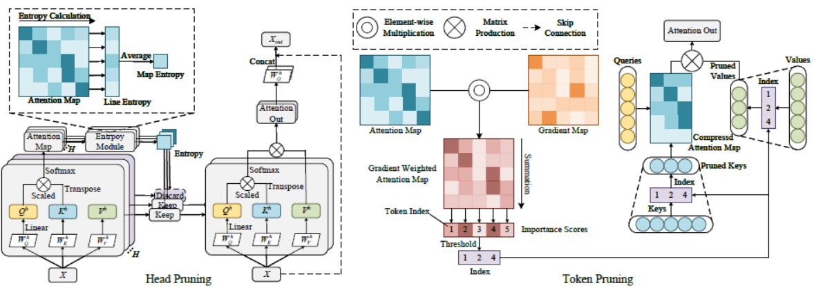

# Attention Map Guided Vision Transformer Pruning for Occluded Person Re-identification on Edge Device
ViT pruning method based on attention map information for occluded person Re-ID. Including token pruning and head pruning
 


# Introduction

We prune the attention heads and tokens for compression of the ViT backbone on Market-1501 and Occluded DukeMTMC. 
The baseline model used is [LA-Transformer](https://github.com/SiddhantKapil/LA-Transformer). We only add the pruning and fine-tuning module. The original training and testing code has no change. 

# Pipeline



# Installation
```
pip install -r requirements.txt
```

# Pretrained Models

We provide pretrained model on google drive for directly pruning.
The [LA-base on Market-1501](https://drive.google.com/drive/folders/1CRkfn9iLEItaYur1WGf2abvpd2vT7nRB?usp=sharing) is from the original repository. 
The [LA-tiny on Occluded-Duke](https://drive.google.com/file/d/18TD3EOInEJO7s3axPFJEdvs2TduXigl9/view?usp=sharing) and [LA-base on Occluded-Duke](https://drive.google.com/file/d/1VU99Y1GddeiB7gkSrUiuqflyf08wN5IF/view?usp=sharing) is trained by ourselves.

# Datasets

Currently two datasets are supported: Market-1501 and Occluded-DukeMTMC. 

You can download the Market-1501 on [this](https://drive.google.com/drive/folders/1CRkfn9iLEItaYur1WGf2abvpd2vT7nRB?usp=sharing)
for the Imagefolder form. 

You can download the extract list for Occluded-Duke from [here](https://github.com/lightas/Occluded-DukeMTMC-Dataset).
We modify the [convert_duke_to_occduke.py](./convert_duke_to_occduke.py) for the form of Imagefolder dataloader. The usage is the same with the origin.

The directory should be renamed like:
```
data
├── market1501
│   └── train 
│   └── query 
│   └── gallery
├── Occluded_Duke
│   └── train 
│   └── query 
│   └── gallery
```
# Training
train LA-base
```
python LATransformer/train.py --name LA-base --model amg_vit_base_patch16_224 --batch-size 32 \
--data-dir [path/to/dataset]
```
train LA-tiny
```
python LATransformer/train.py --name LA-tiny --model amg_vit_tiny_patch16_224 --batch-size 256 \
--data-dir [path/to/dataset]
```

# Pruning and fine-tuning
Make sure you have downloaded or trained the pretrained weights 

prune 40% tokens on LA-tiny 
```
python LATransformer/finetune.py  --name o-duke-ti16-attn40 --model amg_vit_tiny_patch16_224 \
--weight-path [path\to\pretrained-weight] \
--data-dir [path\to\dataset] --batch-size 256 \
--prune_mode attn --prune_rate 0.40 --iter_nums 1 --finetune_nums 0 --final_finetune 10 --lr 1e-4 --wd 1e-3 \
--distill-type soft --distill-alpha 0.2 --distill-tau 1
```
prune 67% heads on LA-tiny
```
python LATransformer/finetune.py  --name o-duke-ti16-head67 --model amg_vit_tiny_patch16_224 \
--weight-path [path\to\pretrained-weight] \
--data-dir [path\to\dataset] --batch-size 256 \
--prune_mode head_entropy --prune_rate 0.67 --iter_nums 24 --finetune_nums 1 --final_finetune 10 --lr 1e-4 --wd 1e-3 \
--distill-type soft --distill-alpha 0.2 --distill-tau 1
```

# Evaluate the Pruned Models
Evaluate on Market-1501
```
python LATransformer/test.py --model [model-tpye] --weight-path [path\to\weight] \
--dataset market --batch-size 128 --data-dir [path\to\dataset]
```

Evaluate on Occluded-DukeMTMC
```
python LATransformer/test.py --model [model-tpye] --weight-path [path\to\weight] \
--dataset o-duke --batch-size 128 --data-dir [path\to\dataset]
```

# Results and Models


## Pruning Results

| Method                 |  model  |   dataset    |  MSA param |  FLOPS  |  Rank1   |  mAP    | model link    |
|:-----------------------|:--------|:-------------|:-----------|:--------|:---------|:--------|:------------------------------------------------------------------------------------------------------------------------------------------------|
|  token 40%             | LA-Base | Market-1501  |    28.4M   |  14.8G  |  97.92   |  92.32  |  [model](https://drive.google.com/file/d/1updZP0Y3Jjh0oQ8Zl1C78YvqKnAqgzyB/view?usp=sharing)             |
|  head 40%              | LA-Base | Market-1501  |    17.0M   |  15.3G  |  98.36   |  92.73  |  [model](https://drive.google.com/file/d/1jRzkZW_k_hx3Mf5XefsGh8ZWn2qXqcny/view?usp=sharing)             |
|  head 25% + token 25%  | LA-Base | Market-1501  |    21.3M   |  14.6G  |  98.55   |  93.06  |  [model](https://drive.google.com/file/d/1ihD52Mwfgc7HvKNLKW4Ou6eHez9gGHyO/view?usp=sharing)             |
|  token 40%             | LA-Tiny | Occluded-Duke|    1.79M   |  0.98G  |  94.61   |  86.91  |  [model](https://drive.google.com/file/d/1w1icUdf_qrrcQHBhiASZG4DQmRu-Ked0/view?usp=sharing)             |
|  head 67%              | LA-Tiny | Occluded-Duke|    0.60M   |  0.87G  |  94.29   |  86.23  |  [model](https://drive.google.com/file/d/1rVr2njy57enttUmyCRCeZoi9uNEFtA8u/view?usp=sharing)             |
|  head 15% + token 25%  | LA-Tiny | Occluded-Duke|    0.60M   |  0.79G  |  93.80   |  85.71  |  [model](https://drive.google.com/file/d/10lpPNstRfqhMh57fa8uwnCRNXixTTq9y/view?usp=sharing)             |


# Acknowledge
1. https://github.com/SiddhantKapil/LA-Transformer


